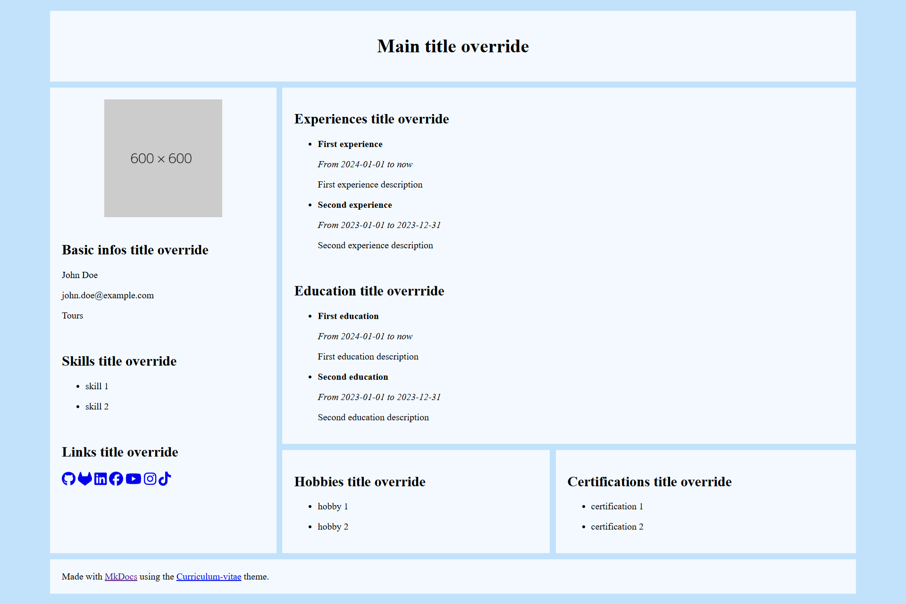

# mkdocs-curriculum-vitae

## Description

A MkDocs theme, made to build your own curriculum vitae.

This theme generates a single page, for now you cannot put other md files than the index. There isn't any navbar.

Currently you cannot configure grid layout, or colors. This will be implemented soon.

## Demo

You can see a [live exmple here](https://paul-riviere.github.io/mkdocs-curriculum-vitae-example/) and see how it is configured on [the demo project](https://github.com/Paul-Riviere/mkdocs-curriculum-vitae-example).

Here's an example with basic configuration :

## Contributing

See [CONTRIBUTING.md](CONTRIBUTING.md) file.