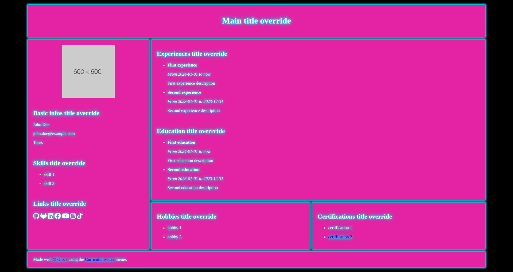

# How to use it

In you `mkdocs.yml` file, put the curriculum-vitae theme :

```yml
theme:
  name: curriculum-vitae
```

Next, you just have to create a `docs` folder in your repo, and only put an empty `index.md`.

## Configuration

What you have to do is play with the theme variables :

### Layouts

Choosing a layout is optional, without the variable, the *default* layout will be applied to your CV.

To select one, you just have to define the `mkcv_layout` variable :

```yml
# mkdocs.yml

theme:
  name: curriculum-vitae
  mkcv_layout: default
```

Multiple themes are available, that affects CSS :

- **default**
  
- **vertical**
  

### Theming

Choosing a theme is optional, without the variable, the *default* theme will be applied to your CV.

To select one, you just have to define the `mkcv_theme` variable :

```yml
# mkdocs.yml

theme:
  name: curriculum-vitae
  mkcv_theme: default
```

Multiple themes are available, that affects CSS :

- **default**
  
- **neon**
  
- **nes**
  

### Basic informations

- `firstname`
- `lastname`
- `mail`
- `location`

Example :

```yml
firstname: John
lastname: Doe
mail: john.doe@example.com
location: Tours
```

### Profile picture

- `profile_picture`

Example :

```yml
profile_picture: https://dummyimage.com/600x600/
```

### Experiences

- `experiences`

Each `experience` has a `title`, and a `description`. You can also add a `start_date` and `end_date`.

You can set `start_date` without `end_date`, this will put "now" instead.

Example :

```yml
experiences:
  - title: First experience
    description: First experience description
    start_date: 2024-01-01
  - title: Second experience
    description: Second experience description
    start_date: 2023-01-01
    end_date: 2023-12-31
```

### Education

- `educations`

Each `education` has a `title`, and a `description`. You can also add a `start_date` and `end_date`.

You can set `start_date` without `end_date`, this will put "now" instead.

```yml
educations:
  - title: First education
    description: First education description
    start_date: 2024-01-01
  - title: Second education
    description: Second education description
    start_date: 2023-01-01
    end_date: 2023-12-31
```

### Skills

- `skills`

```yml
skills:
  - skill 1
  - skill 2
```

### Hobbies

- `hobbies`

```yml
hobbies:
  - hobby 1
  - hobby 2
```

### Certifications

- `certifications`

Each `certification` must have a `name`, and optionnaly you can specify a `link` if you want to.

```yml
certifications:
  - name: certification 1
  - name: certification 2
    link: htttps://exemple.com
```

### Personnal links

You can add links to your CV, those variables are optionnal. The link will appear only if the associated variable is defined.

```yml
personnal_links:
  github: https://example.com/
  gitlab: https://example.com/
  linkedin: https://example.com/
  facebook: https://example.com/
  youtube: https://example.com/
  Instagram: https://example.com/
  tiktok: https://example.com/
  x: https://example.com/
```

### Titles override

You can override titles with ease with those variables. You don't need to define them, as they have default values.

```yml
main_title: Main title override
basic_informations_section_title: Basic infos title override
personnal_links_section_title: Links title override
experiences_section_title: Experiences title override
education_section_title: Education title overrride
skills_section_title: Skills title override
hobbies_section_title: Hobbies title override
```

### Full Example

```yml
# mkdocs.yml

theme:
  name: curriculum-vitae
  mkcv_layout: default
  mkcv_theme: default
  firstname: John
  lastname: Doe
  mail: john.doe@example.com
  location: Tours
  profile_picture: https://dummyimage.com/600x600/
  main_title: Main title override
  basic_informations_section_title: Basic infos title override
  skills_section_title: Skills title override
  personnal_links_section_title: Links title override
  experiences_section_title: Experiences title override
  education_section_title: Education title overrride
  hobbies_section_title: Hobbies title override
  certifications_section_title: Certifications title override
  skills:
    - skill 1
    - skill 2
  hobbies:
    - hobby 1
    - hobby 2
  certifications:
    - name: certification 1
    - name: certification 2
      link: htttps://exemple.com
  personnal_links:
    github: https://example.com/
    gitlab: https://example.com/
    linkedin: https://example.com/
    facebook: https://example.com/
    youtube: https://example.com/
    Instagram: https://example.com/
    tiktok: https://example.com/
    x: https://example.com/
  experiences:
    - title: First experience
      description: First experience description
      start_date: 2024-01-01
    - title: Second experience
      description: Second experience description
      start_date: 2023-01-01
      end_date: 2023-12-31
  educations:
    - title: First education
      description: First education description
      start_date: 2024-01-01
    - title: Second education
      description: Second education description
      start_date: 2023-01-01
      end_date: 2023-12-31
```
